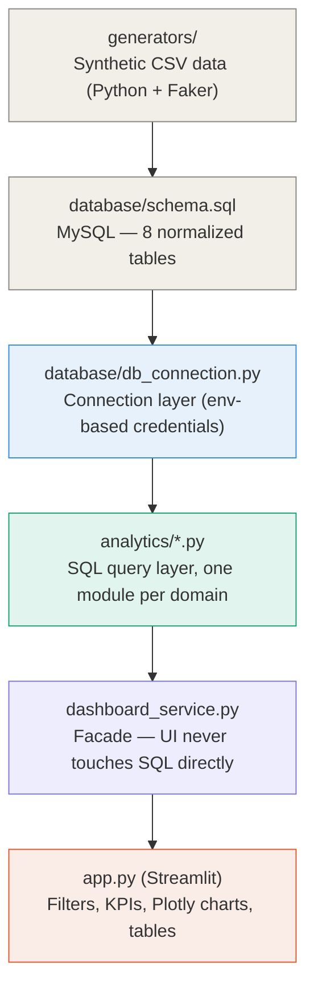
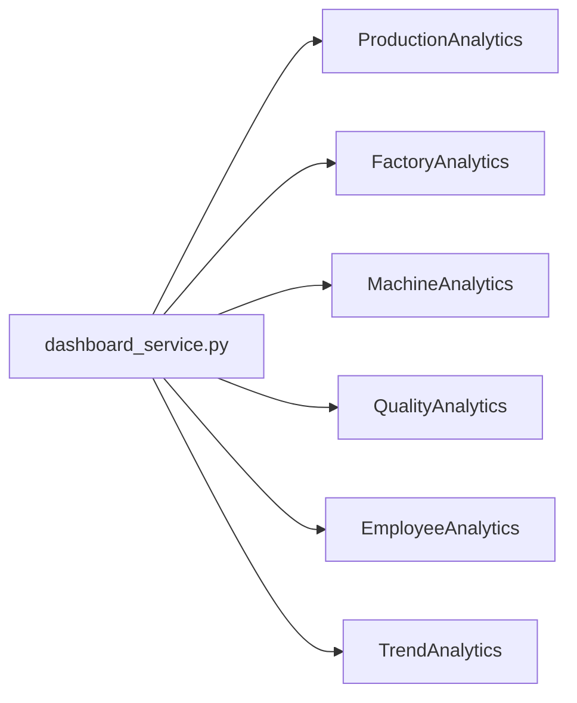

# Architecture

## Analytics module map

Each `*Analytics` class owns its own SQL and returns a pandas `DataFrame`. `app.py` only ever calls `DashboardService` — it never imports `analytics/*` directly — which keeps the query logic swappable (e.g. to a different DB, or to cached/precomputed data) without touching the UI.
